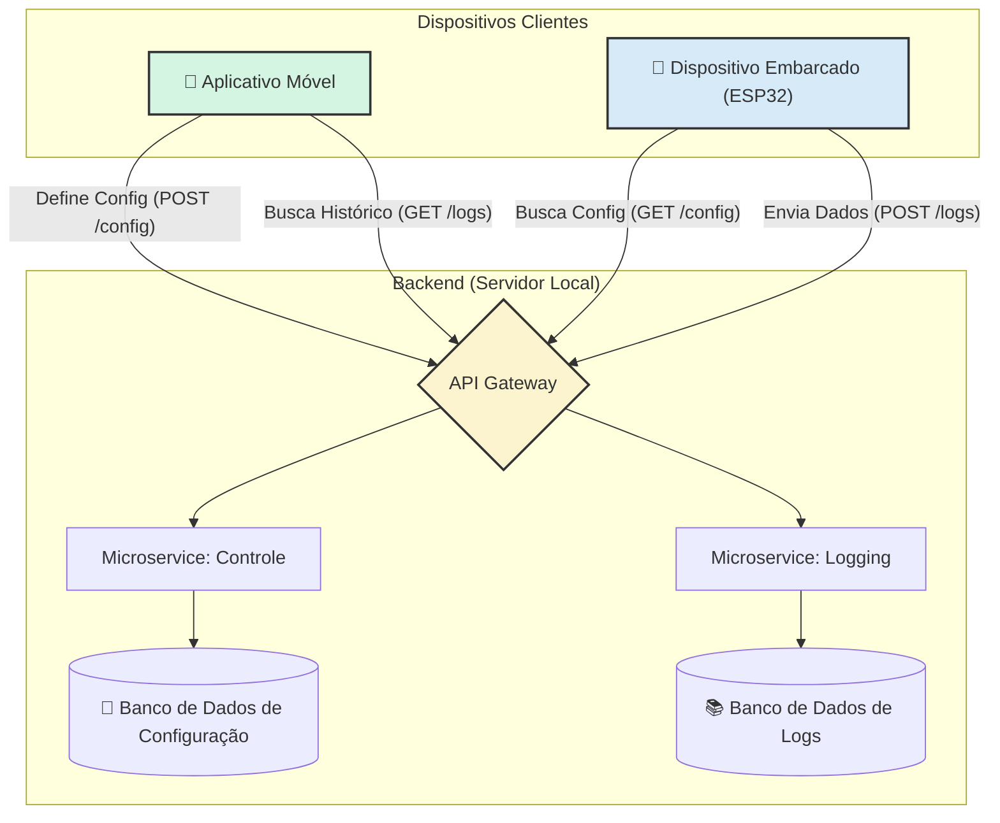

# Projeto Final: Sistema de Monitoramento IoT com Backend e App Móvel

Este projeto integra conceitos de Sistemas Embarcados, Backend com Microservices e Desenvolvimento de Aplicativos Móveis para criar uma solução de Internet das Coisas (IoT) completa e funcional.

O sistema permite monitorar um ambiente usando um sensor de distância (HC-SR04) conectado a um microcontrolador ESP32. As regras de operação do sensor são configuradas remotamente através de um aplicativo móvel, que se comunica com um backend central. O backend também é responsável por armazenar e fornecer o histórico de medições do sensor para visualização no aplicativo.

---

## Arquitetura do Sistema

O projeto é dividido em três subsistemas principais que se comunicam através de uma rede local Wi-Fi, seguindo o fluxo abaixo:



---

## Funcionalidades

| Subsistema         | Funcionalidade                                  |
| ------------------ | ----------------------------------------------- |
| **Sistema Embarcado** | ✅ Leitura de dados do sensor (HC-SR04)           |
|                    | ✅ Controle do atuador (Buzzer)                 |
|                    | ✅ Configuração via backend (busca de parâmetros) |
|                    | ✅ Envio de dados para o backend (logging)      |
| **Aplicativo Móvel** | ✅ Leitura dos dados do backend (histórico)      |
|                    | ✅ Visualização dos dados (gráfico)             |
|                    | ✅ Configuração do sistema embarcado            |
| **Backend** | ✅ Configuração do sistema embarcado (armazenar)  |
|                    | ✅ Recebimento de dados do sistema embarcado    |
|                    | ✅ Envio de dados ao aplicativo                 |

---

## Pré-requisitos

Antes de começar, garanta que você tenha os seguintes softwares e hardwares instalados e configurados:

### Software:
- **[Node.js](https://nodejs.org/) (v18 ou superior):** Ambiente de execução para o backend.
- **[ESP-IDF](https://docs.espressif.com/projects/esp-idf/en/latest/esp32/get-started/index.html) (v5.0 ou superior):** Framework de desenvolvimento para o ESP32.
- **[Expo CLI](https://docs.expo.dev/get-started/installation/):** Ferramenta para desenvolvimento do aplicativo React Native.
  ```bash
  npm install -g expo-cli
  ```
- **[Expo Go App](https://expo.dev/go):** Aplicativo para celular (iOS/Android) para rodar o app móvel.
- **[Postman](https://www.postman.com/downloads/) (Opcional):** Ferramenta para testar as APIs do backend diretamente.

### Hardware:
- **Placa ESP32:** Qualquer variante do ESP32 Development Kit.
- **Sensor Ultrassônico HC-SR04.**
- **Buzzer Ativo.**
- **Protoboard e Jumpers.**

---

## Estrutura do Projeto

```
/projeto-final
├── /backend
│   ├── /api-gateway
│   ├── /service-control
│   └── /service-logging
├── /embedded-system
│   └── /main
└── /mobile-app
```

---

## 🚀 Instalação e Execução

**⚠️ IMPORTANTE:** Todos os dispositivos (computador com backend, ESP32 e smartphone) devem estar conectados na **mesma rede Wi-Fi**.

### 1. Backend

O backend consiste em 3 serviços que devem ser executados em terminais separados.

#### a. Iniciar o Microservice de Controle
```bash
cd backend/service-control
npm install
node index.js
```
> O serviço estará rodando na porta `3001`.

#### b. Iniciar o Microservice de Logging
```bash
cd backend/service-logging
npm install
node index.js
```
> O serviço estará rodando na porta `3002`.

#### c. Iniciar o API Gateway
```bash
cd backend/api-gateway
npm install
node index.js
```
> O gateway estará rodando na porta `3000`, que é o ponto de entrada único para toda a aplicação.

### 2. Sistema Embarcado (ESP32)

#### a. Ativar o Ambiente ESP-IDF
Abra um novo terminal e ative o ambiente do ESP-IDF.
- **Windows:** Use o "ESP-IDF Command Prompt".
- **Linux/macOS:** `source /caminho/para/esp-idf/export.sh`

#### b. Configurar o Código
1.  Navegue até a pasta do projeto: `cd embedded-system`
2.  Abra o arquivo `main/network.c` e **altere a constante `BACKEND_IP`** para o endereço IP do seu computador.
    ```c
    #define BACKEND_IP "192.168.1.10" // <-- MUDE AQUI
    ```
3.  Abra o arquivo `main/main.c` e altere as constantes `WIFI_SSID` e `WIFI_PASS` com as credenciais da sua rede.

#### c. Configurar os Pinos do Hardware
1.  Execute `idf.py menuconfig`.
2.  Navegue até `Component config --->` > `HCSR04 Driver`.
3.  Defina os pinos GPIO para o `Trigger Pin` e `Echo Pin` de acordo com seu circuito.
4.  Salve e saia.

#### d. Compilar e Gravar
1.  Conecte a placa ESP32 ao computador.
2.  Execute o comando abaixo, substituindo `<SUA_PORTA>` pela porta serial correta (ex: `COM3` ou `/dev/ttyUSB0`).
    ```bash
    idf.py -p <SUA_PORTA> flash monitor
    ```
> O monitor serial mostrará os logs de conexão, medição e comunicação com o backend.

### 3. Aplicativo Móvel

#### a. Instalar Dependências
```bash
cd mobile-app
npm install
# ou use npx expo install para garantir compatibilidade
```

#### b. Configurar o Código
1.  Abra o arquivo `App.js`.
2.  **Altere a constante `BACKEND_IP`** para o mesmo endereço IP do seu computador que você usou no sistema embarcado.
    ```javascript
    const BACKEND_IP = '192.168.1.10'; // <-- MUDE AQUI
    ```

#### c. Executar o Aplicativo
1.  Inicie o servidor de desenvolvimento do Expo.
    ```bash
    npx expo start
    ```
2.  Abra o aplicativo **Expo Go** no seu celular e escaneie o QR Code que apareceu no terminal.
> O aplicativo será carregado no seu celular.

---

## 🧪 Plano de Testes

Execute os seguintes testes para validar todas as funcionalidades do sistema.

| Subsistema          | Funcionalidade                     | Ação a ser Realizada                                                                                                                              | Resultado Esperado                                                                                                                                  | Como Verificar                                                                                                                                        |
| ------------------- | ---------------------------------- | ------------------------------------------------------------------------------------------------------------------------------------------------- | ----------------------------------------------------------------------------------------------------------------------------------------------------- | ----------------------------------------------------------------------------------------------------------------------------------------------------- |
| **Backend** | Configuração do Sist. Embarcado    | Envie uma requisição `POST` para `http://<IP>:3000/config` com o corpo `{"threshold_cm": 15}` usando o Postman.                                      | O servidor responde com status `200 OK` e a mensagem de sucesso.                                                                                      | Verifique o terminal do `service-control`. Abra o arquivo `controle.db` com um visualizador de SQLite e veja se o valor foi atualizado.                |
| **Backend** | Receb. de dados do Sist. Embarcado | Com o ESP32 rodando, aproxime um objeto do sensor.                                                                                                | Requisições `POST` chegam no endpoint `/logs`.                                                                                                        | Verifique o terminal do `api-gateway` e do `service-logging`. Abra o arquivo `logging.db` e veja se novos registros de distância estão sendo inseridos. |
| **Backend** | Envio de dados ao Aplicativo       | Envie uma requisição `GET` para `http://<IP>:3000/logs` usando o Postman ou o navegador.                                                            | O servidor responde com status `200 OK` e um JSON contendo o array de logs.                                                                           | O corpo da resposta deve conter os dados que foram salvos no passo anterior.                                                                          |
| **Aplicativo Móvel** | Configuração do Sist. Embarcado    | Na tela "Configuração" do app, digite `25` no campo de texto e pressione "Salvar Configuração".                                                   | Um alerta de "Sucesso!" aparece na tela. O valor de "Limiar Atual" é atualizado para 25 cm.                                                          | O terminal do `service-control` deve registrar a requisição. O valor no `controle.db` deve ser 25.                                                    |
| **Aplicativo Móvel** | Leitura e Visualização dos Dados   | Navegue para a tela "Histórico" e pressione "Atualizar Dados".                                                                                    | O gráfico é preenchido com as últimas medições de distância.                                                                                          | Os dados exibidos no gráfico devem corresponder aos últimos registros no `logging.db`.                                                                |
| **Sistema Embarcado** | Configuração via Backend           | Com o ESP32 rodando, altere o limiar no aplicativo móvel para `10`.                                                                               | O ESP32, no próximo ciclo, buscará a nova configuração.                                                                                               | No monitor serial do ESP32, a linha de log "Limiar atual" deve mudar de `25 cm` (ou outro valor) para `10 cm`.                                        |
| **Sistema Embarcado** | Leitura de dados e Envio de Log    | Deixe o ESP32 rodando.                                                                                                                            | O ESP32 mede a distância periodicamente.                                                                                                              | O monitor serial exibe "Distância medida: XX cm". O terminal do `service-logging` recebe requisições `POST` a cada ciclo.                              |
| **Sistema Embarcado** | Controle do Atuador                | Aproxime sua mão do sensor a uma distância menor que o limiar configurado (ex: menor que 10 cm).                                                  | O buzzer deve emitir um som curto.                                                                                                                    | Ouça o som do buzzer. O monitor serial deve exibir a mensagem de "ALERTA!".                                                                           |
